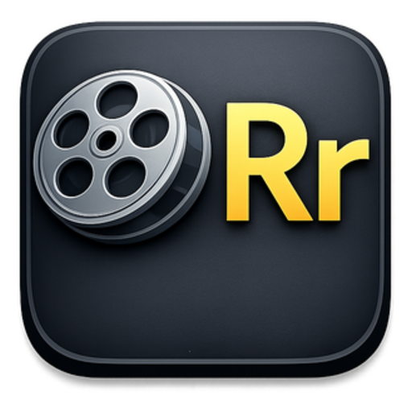

<p align="center">
  
</p>

<h1 align="center">Renamr</h1>

<p align="center">
  <strong>Free, open-source media file organizer</strong><br/>
  A modern alternative to FileBot — with audiobook and ROM support.
</p>

<p align="center">
  <a href="https://github.com/your-username/renamr/releases/latest"></a>
  <a href="LICENSE"></a>
  
  
</p>

---

Rename and organize your **movies**, **TV shows**, **audiobooks**, and **ROMs** with metadata from TMDB, OMDb, OpenLibrary, and IGDB. Drag and drop your files, match them to the correct metadata, customize your naming format, and rename everything in one click.

## ✨ Features

**🎬 Movies** — Auto-match to TMDB/OMDb metadata, parse titles and years from filenames, manual search for tricky names, custom naming formats.

**📺 TV Shows** — Detect `S##E##` patterns automatically, fetch episode titles, batch-match entire seasons, organize into season folders.

**🎧 Audiobooks** — Read embedded audio metadata (ID3, M4B tags), lookup book info from OpenLibrary, display cover art, organize by Author/Title/Chapter. Supports MP3, M4A, M4B, FLAC, OGG, and more.

**🎮 ROMs** — Parse No-Intro formatted filenames, search IGDB for game metadata, detect platform from file extension (30+ supported), handle multi-disc sets, DLC, and game updates with separate naming formats. ES-DE system name support included.

**📁 Batch Organize** — Sort files by type (Video, Audio, Images, Documents), by date modified, by file extension, or alphabetically. Preview everything before executing.

**⚙️ Format Editor** — Build custom naming expressions with live preview. Use variables like `{title}`, `{year}`, `{series}`, `{season}`, `{episode}`, `{author}`, `{track}`, `{narrator}`, `{platform}`, `{disc}`, `{contentType}`, `{version}`, and more. Zero-pad numbers with `{season:2}` → `02`.

**📜 History & Undo** — Full history of all rename operations with one-click undo for any batch (with confirmation dialog).

## 📥 Installation

### Option 1: Download the Installer (Recommended)

Download the latest Windows installer from the **[Releases](https://github.com/your-username/renamr/releases/latest)** page. Run the `.exe` and follow the setup wizard.

### Option 2: Run from Source

Requires [Node.js](https://nodejs.org/) v18 or later.

```bash
git clone https://github.com/your-username/renamr.git
cd renamr
npm install
npm start
```

Or just double-click `START.bat` on Windows — it handles everything.

## 🔧 First-Time Setup

1. Open the app and go to **Settings**
2. Enter your **TMDB API key** — get one free at [themoviedb.org](https://www.themoviedb.org/settings/api)
3. *(Optional)* Add an **OMDb API key** for an additional metadata source
4. *(Optional)* Add **IGDB credentials** (Client ID + Client Secret) to enable ROM matching — register free at [dev.twitch.tv](https://dev.twitch.tv/console)
5. *(Optional)* Set a default output directory
6. You're ready to go!

> **Note:** Audiobook lookups use OpenLibrary, which is free and requires no API key.

## 📖 Usage

### Renaming Media

1. Open the **Organize** tab
2. Click **Add Folder** or drag and drop your files
3. Files are automatically grouped by type (Movies, TV, Audiobooks, ROMs)
4. Click **Match All** to auto-match with metadata
5. Review the proposed names in the preview
6. Click **Rename All** to execute

### ROM-Specific Workflow

1. Drop ROM files onto the Organize tab — platform is detected from file extension automatically
2. Click **Match All** (requires IGDB credentials in Settings)
3. For ambiguous titles, click the search icon on any row to search manually and filter by platform
4. Right-click any ROM row to manually set **disc number** or **content type** (Game / DLC / Update)
5. Use **Set Selected As** or **Set All As** in the right-click menu to bulk-tag files
6. Separate naming formats for games, DLC, and updates can be configured in the **Format Editor**

### Custom Naming Formats

Go to **Format Editor** to customize how files are named. Use `/` to create folder structure.

| Type | Variables |
|------|-----------|
| Movies | `{title}`, `{year}`, `{rating}`, `{resolution}`, `{source}`, `{videoCodec}`, `{audioCodec}`, `{hdr}`, `{edition}`, `{group}`, `{channels}` |
| TV Shows | `{series}`, `{season}`, `{episode}`, `{title}`, `{year}`, `{resolution}`, `{source}`, `{group}` |
| Audiobooks | `{author}`, `{title}`, `{series}`, `{bookNum}`, `{year}`, `{track}`, `{narrator}`, `{genre}`, `{chapter}` |
| ROMs | `{title}`, `{platform}`, `{platformShort}`, `{esdeSystem}`, `{year}`, `{genre}`, `{developer}`, `{region}`, `{disc}`, `{contentType}`, `{version}` |

**Examples:**

```
Movie:     {title} ({year})/{title} ({year})
           → The Matrix (1999)/The Matrix (1999).mkv

TV Show:   {series}/Season {season}/{series} - S{season:2}E{episode:2} - {title}
           → Breaking Bad/Season 02/Breaking Bad - S02E09 - 4 Days Out.mkv

Audiobook: {author}/{title}/{title} - Chapter {track:2}
           → Frank Herbert/Dune/Dune - Chapter 01.m4b

ROM Game:  {platform}/{title} ({year})
           → Super Nintendo Entertainment System/Super Mario World (1990).sfc

ROM DLC:   {platform}/DLC/{title}
           → Nintendo Switch/DLC/Breath of the Wild - DLC Pack 2.nsp

ROM Update: {platform}/Update/{title} ({version})
           → Nintendo Switch/Update/Kirby and the Forgotten Land (v1.1.0).nsp
```

> **Tip:** Enable **ES-DE System Names** in Settings to use EmulationStation Desktop Edition folder names (`snes`, `switch`, etc.) instead of full platform names.

## ⌨️ Keyboard Shortcuts

| Shortcut | Action |
|----------|--------|
| `Ctrl+1` through `Ctrl+6` | Switch between tabs |
| `Escape` | Close modal |

## 🏗️ Building from Source

```bash
# Build for your current platform
npm run build

# Platform-specific builds
npm run build:win      # Windows (.exe installer)
npm run build:mac      # macOS (.dmg)
npm run build:linux    # Linux (.AppImage)
```

## 🛠️ Tech Stack

- **Electron 31** — Desktop framework
- **Vanilla JS** — No build step, no framework overhead
- **TMDB API** — Movie and TV metadata
- **OMDb API** — Additional movie metadata
- **OpenLibrary API** — Book and audiobook metadata
- **IGDB API** — Game and ROM metadata (via Twitch Developer)
- **music-metadata** — Audio file tag reading
- **electron-store** — Persistent settings
- **ffprobe** — Media file analysis

## 🎮 Supported ROM Platforms

| Platform | Extensions |
|----------|------------|
| Nintendo Switch | `.nsp`, `.xci` |
| Nintendo 3DS | `.3ds`, `.cia` |
| Nintendo DS | `.nds` |
| Game Boy Advance | `.gba` |
| Game Boy / Color | `.gb`, `.gbc` |
| NES | `.nes` |
| SNES | `.sfc`, `.smc` |
| Nintendo 64 | `.n64`, `.z64`, `.v64` |
| GameCube | `.iso`, `.gcm` |
| Wii | `.wbfs`, `.wad` |
| PlayStation 1 | `.bin`, `.cue`, `.pbp`, `.chd` |
| PlayStation 2 | `.iso` |
| PSP | `.iso`, `.cso` |
| Sega Genesis / Mega Drive | `.md`, `.gen`, `.bin` |
| Sega Game Gear | `.gg` |
| Sega 32X | `.32x` |
| Sega CD | `.iso`, `.bin`, `.cue` |
| Dreamcast | `.gdi`, `.cdi` |
| PC Engine / TurboGrafx | `.pce` |
| Atari 2600 | `.a26` |
| Neo Geo Pocket | `.ngp`, `.ngc` |
| WonderSwan | `.ws`, `.wsc` |

## 📄 License

[MIT](LICENSE) — Free and open source.

---

<p align="center">
  Built as a free alternative to FileBot. If you find Renamr useful, consider giving it a ⭐
</p>
